## Mermaid

**Mermaid** - это упрощенный и далекий аналог UML - специальный язык описания блок-схем, графиков и диаграмм с их визуализацией.

> ** Самостоятельно доделать это ридми**

### Блок схемы

#### Базовая структура 1
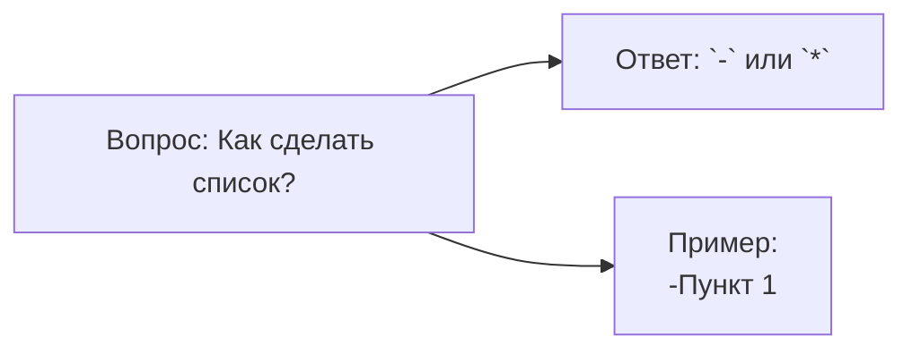
* flowchart - блок-схема
* LR - направление вправо
* A[],B[],C[] - прямоугольник
* --> - cтрелка связи
#### Базовая структура 2
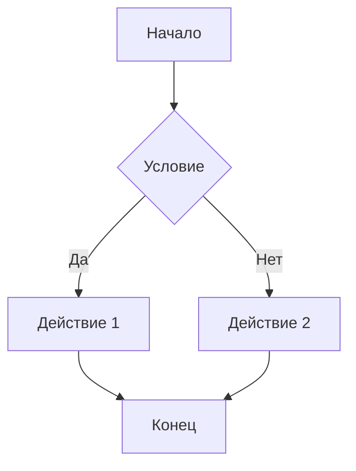

#### Полный синтаксис блок-схем
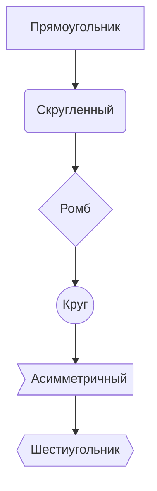

### Диаграмма последовательностей
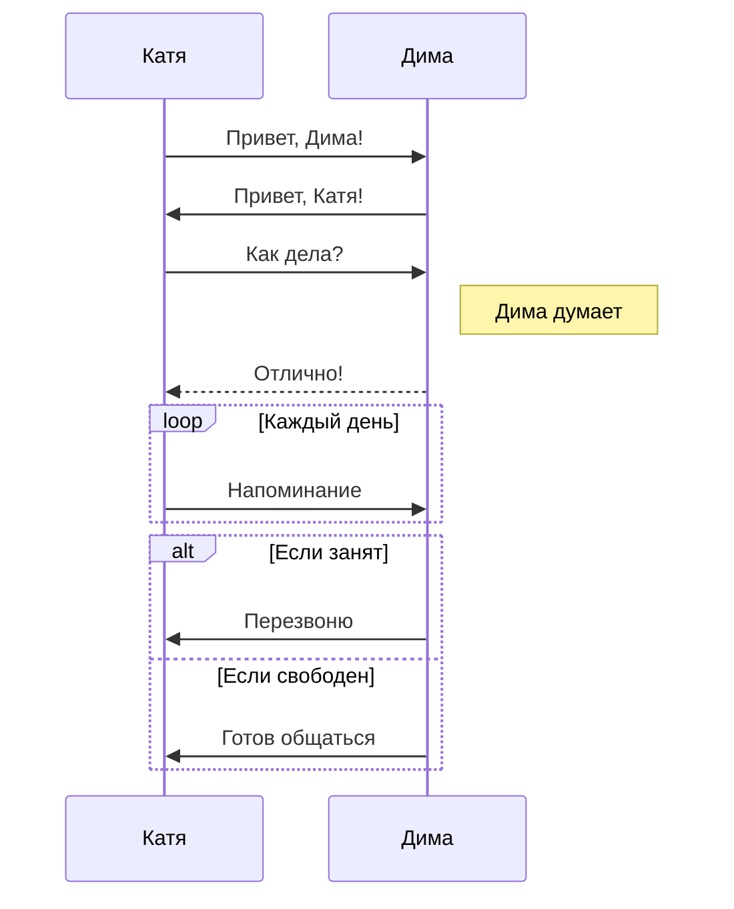

### Диаграмма класса
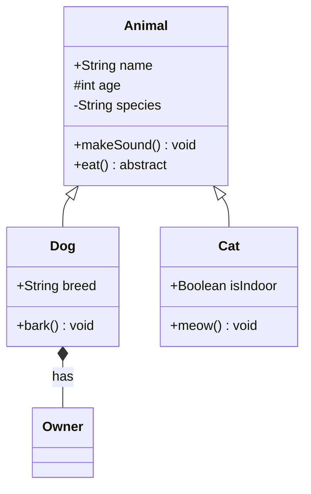
### Диаграмм Ганта

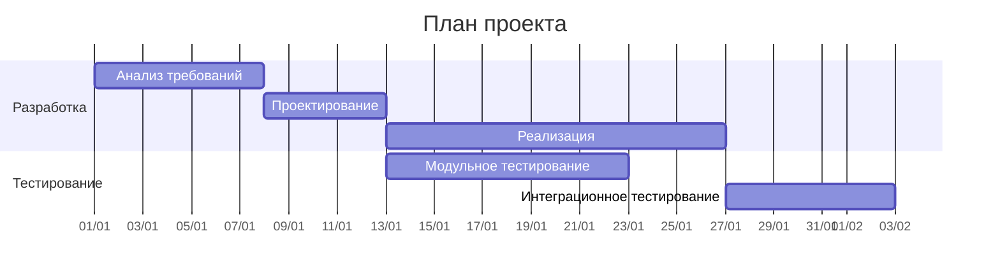

### Граф зависимостей
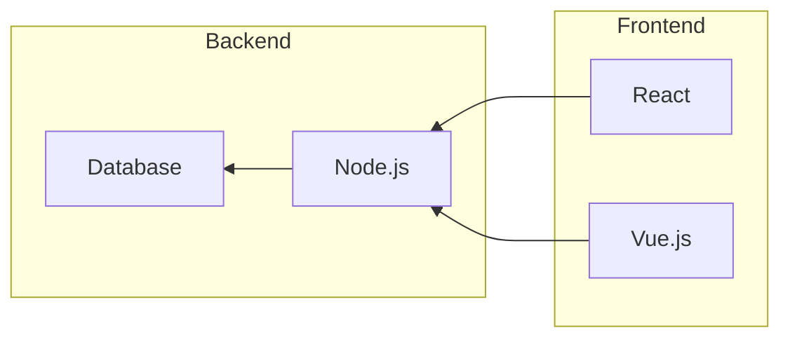

### Диаграмма состояний
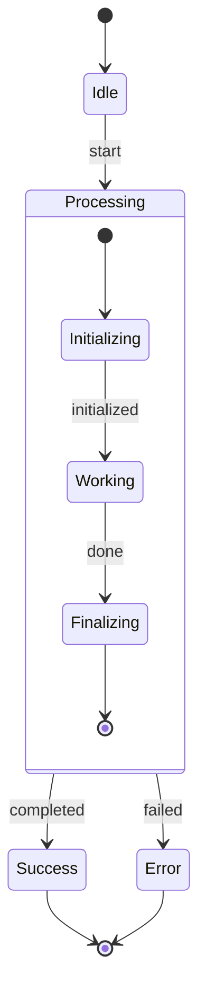

### Юзер-джайрни
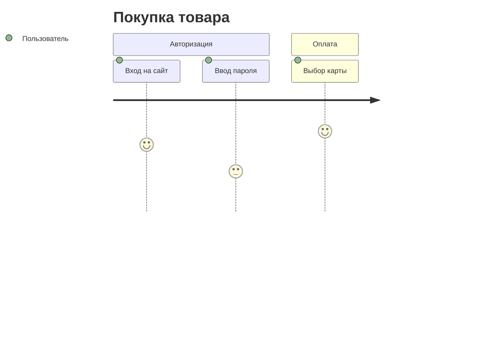

### Кастомизация стилей
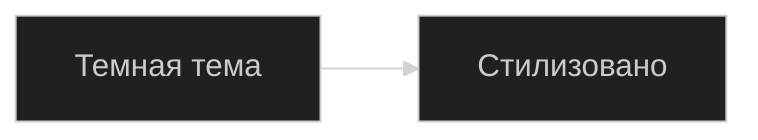

### Классы CSS
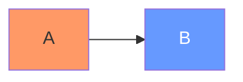

### Интерактиваность
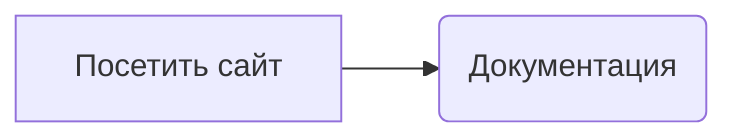

### Круговая диаграмма
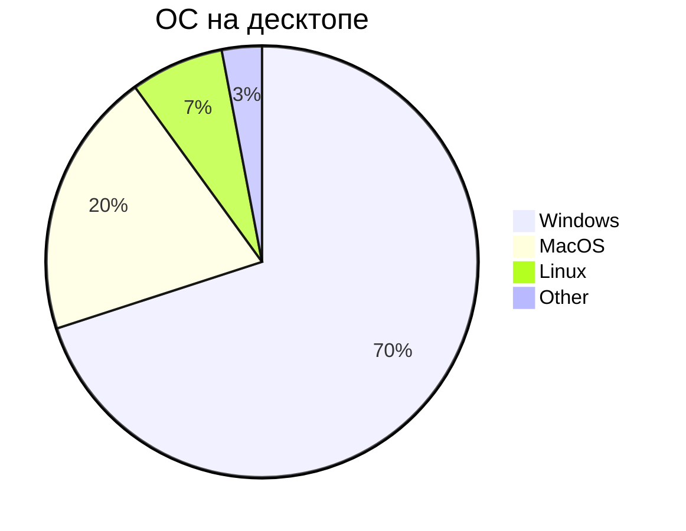
